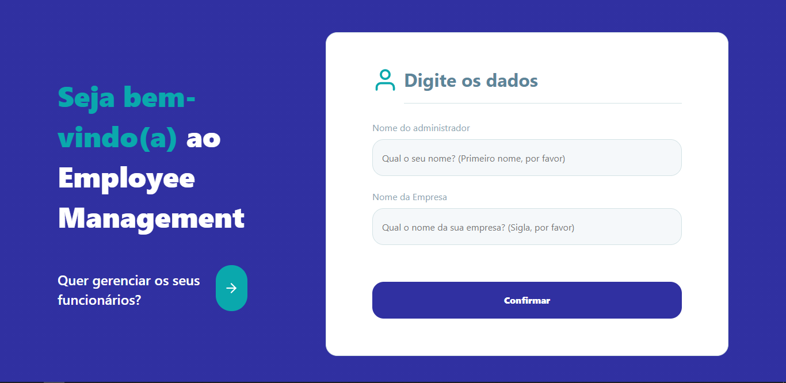
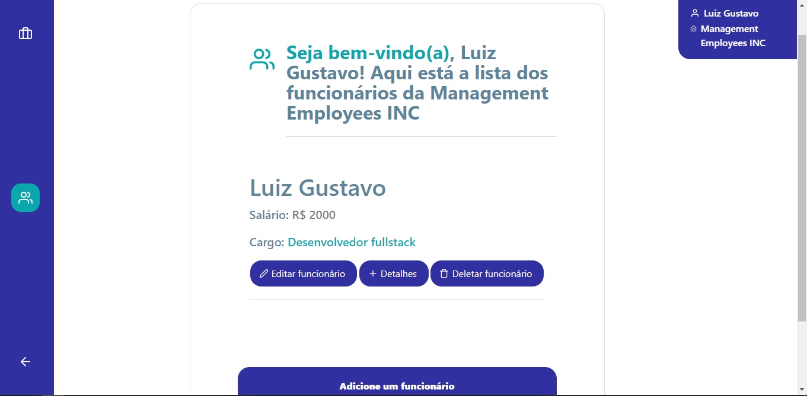

<p align="center">
   
</p>

<h1 align="center"> ⏰ Reminder to Drink Water Website </h1>

<p align="center">
	<a href="https://www.linkedin.com/in/luiz-gustavo-56146b1a5/">
      
   </a>
  

  
  <a href="https://github.com/tonicprism/reminder-to-drink-water/#readme">
    
  </a>
   <a href="https://github.com/tonicprism/reminder-to-drink-water/commits/master">
      
  </a>
   <a href="https://github.com/tonicprism/reminder-to-drink-water/stargazers">
      
   </a>
</p>

> ⏰ The **Reminder to Drink Water Website** is a simple reminder to drink water.

<p align="center">
    <a href="README.md">English</a>
</p>

<div align="center">
  <sub>Reminder to Drink Water Website project. Built with ❤︎ by
    <a href="https://github.com/tonicprism">Luiz Gustavo</a>
  </sub>
</div>

# :pushpin: Table of Contents

- [Technologies](#computer-technologies)
- [How to run](#construction_worker-how-to-run)
- [Issues](#bug-issues)
- [PS](#monocle_face-ps)
- [Contributing](#tada-contributing)

### 📸 Screenshots

<p align="center">
   
</p>
<p align="center">
   
</p>

# :computer: Technologies

This project was made using the follow technologies:

- [React](https://reactnative.dev/)
- [NextJS](https://nextjs.org)
- [Styled Components](https://styled-components.com)
- [Typescript](https://www.typescriptlang.org)
- [ESLint](https://www.npmjs.com/package/eslint)
- [Prettier](https://www.npmjs.com/package/eslint)

# :construction_worker: How to run

Fork this repository and clone to your machine. Inside of the project's folder run the following commands:

```sh
# Install Dependencies
$ yarn

# Run NextJS Application
$ yarn dev
```

# 🧐 PS

If you whats to use the Eslint and Prettier configs follow this tutorial:
[Link](https://dev.to/christiantld/configurando-um-projeto-react-com-typescript-3kg)

# :bug: Issues

Feel free to **file a new issue** with a respective title and description on the the [Reminder to Drink Water Website](https://github.com/tonicprism/giftcard-website/issues) repository. If you already found a solution to your problem, **i would love to review your pull request**!

# :tada: Contributing

Check out the [contributing](./CONTRIBUTING.md) page to see the best places to file issues, start discussions and begin contributing.

# ✌ Made with 💙 by [Luiz Gustavo](https://github.com/tonicprism/)

Give a ⭐️ if this project helped you!
